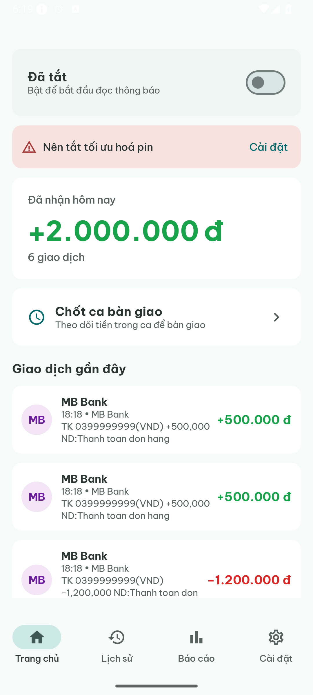
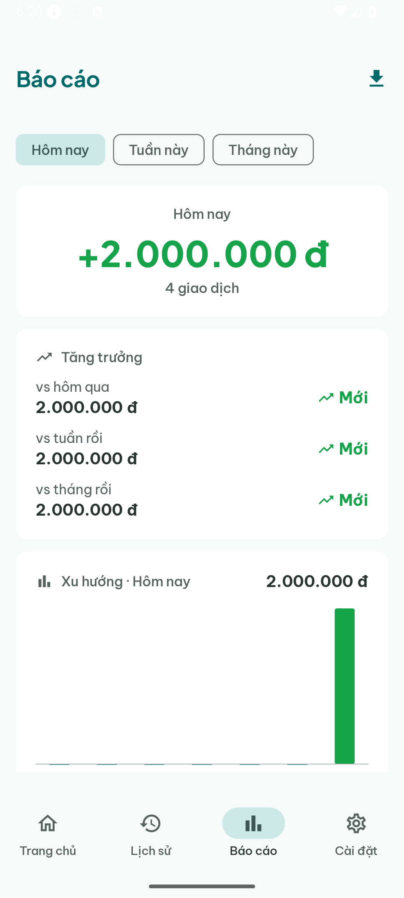
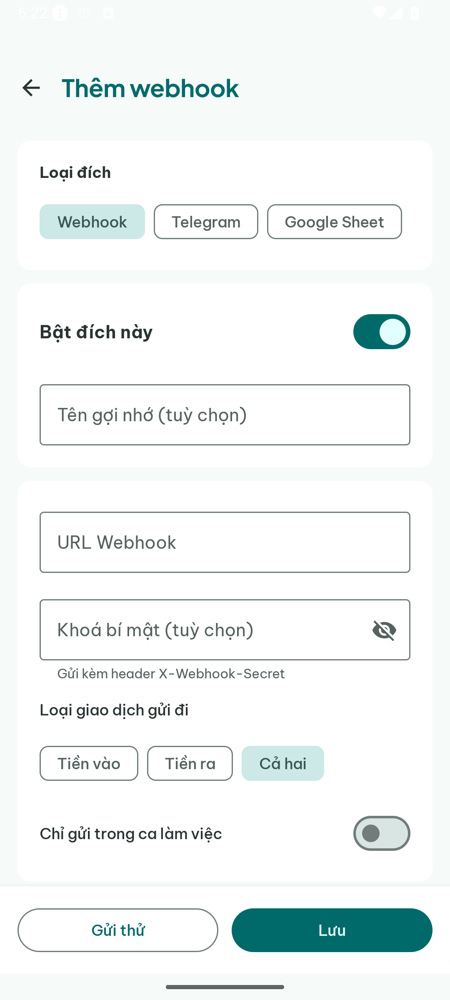
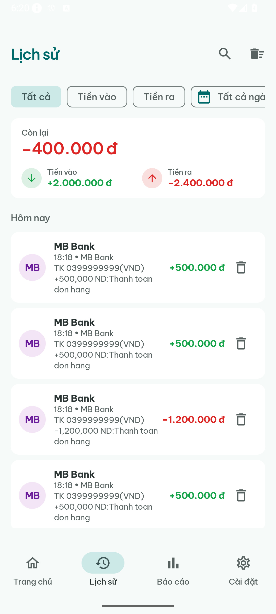
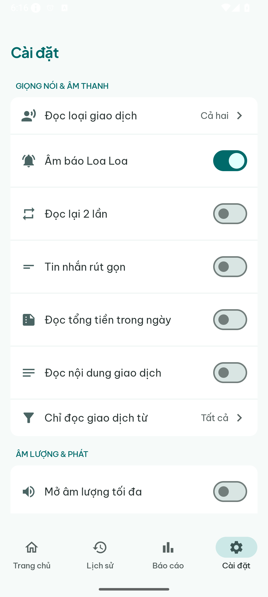
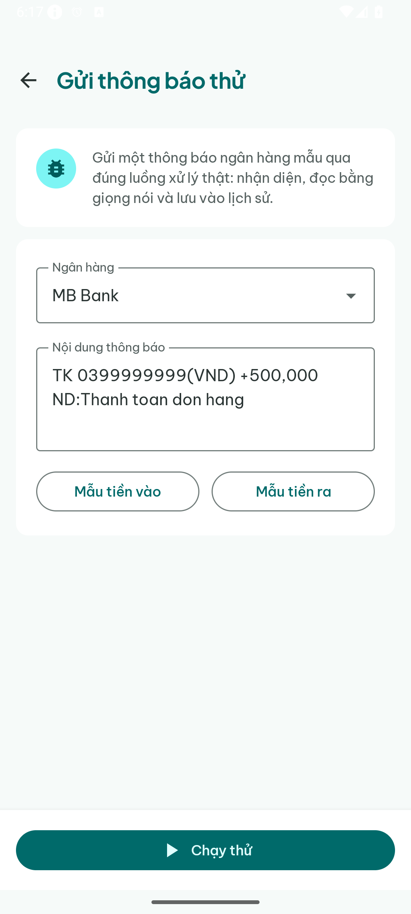

<div align="center">


# Loa Loa Loa 📣

### Nghe rõ từng đồng tiền về — ngay khoảnh khắc nó vào tài khoản.

*Cái loa "Tiền về!" cho mọi quán xá, sạp hàng, quán cà phê Việt Nam — không cần đăng nhập ngân hàng, không cần máy POS đắt tiền.*

[](https://github.com/cuongdev/loaloaloa/releases/latest)
[](https://github.com/cuongdev/loaloaloa/releases/latest/download/loaloaloa.apk)
[](https://github.com/cuongdev/loaloaloa)
[](https://github.com/cuongdev/loaloaloa)

**[🚀 Trang giới thiệu](https://loaloaloa.haveuever.workers.dev/)** · **[⬇️ Tải về](#-cài-đặt)** · **[🌐 Thử ngay trên web](https://loaloaloa.haveuever.workers.dev/web)** · **[⚙️ Hoạt động thế nào](#-hoạt-động-thế-nào)** · **[🛰️ Tự host relay](relay-worker/README.md)**

</div>

---

> ### 💸 "Chuyển rồi anh ơi!"
> Câu nói nghe cả trăm lần mỗi ngày. Người bán thì tay đang gói hàng, mắt không rảnh nhìn điện thoại,
> tai thì ù vì quán đông. Khách thì có khi giơ cái ảnh chuyển khoản... chụp từ hôm qua.
>
> **Loa Loa Loa** đọc to số tiền **ngay khi thông báo ngân hàng nhảy lên màn hình** — bằng tiếng Việt,
> kèm tiếng "ting" báo hiệu. Người bán không cần liếc màn hình, không sợ bị lừa ảnh giả, không bỏ sót
> đơn nào. *Tiền về là cả quán cùng nghe.* 🔊

<div align="center">


&nbsp;&nbsp;

&nbsp;&nbsp;


</div>

---

## 🤔 Loa Loa Loa là gì?

Biến chiếc điện thoại Android thành **cái loa thông báo thanh toán rảnh tay** cho quán Việt.

Thông báo chuyển khoản của ngân hàng vừa hiện lên là app **đọc to số tiền** bằng giọng Việt —
để người bán **nghe được tiền về** mà không cần dán mắt vào điện thoại.

App đọc thẳng **thông báo đẩy của chính ngân hàng**, **ngay trên máy** — **không** cần đăng nhập ngân
hàng, **không** cần API key, **không** chuyển tiếp SMS cho bên thứ ba.

Và khi điện thoại có app ngân hàng nằm một chỗ, còn nhân viên thì ở chỗ khác? App **chuyển tiếp**
(mã hoá đầu-cuối) từng giao dịch sang mọi điện thoại khác — hoặc lên một tab trình duyệt, **khỏi
cần cài app**.

Quán có **nhiều nhân viên, chạy theo ca**? Mỗi người **vào ca** trên máy của mình — hoặc dùng chung
một máy ở quầy — và **mỗi giao dịch tự ghi tên người đang trực**. Cuối ca **chốt một cái** là biết
ca đó ai bán, được bao nhiêu, rồi bàn giao sạch sẽ cho ca sau.

---

## ✨ Tính năng

| | |
|---|---|
| 🔊 **Đọc tiền tức thì** | "Tiền vào năm trăm nghìn đồng" — vang lên ngay giây thông báo ngân hàng tới. Có tiếng chuông báo, cho lặp lại, hiện tổng tiền trong ngày. |
| 🏦 **Dùng được với ngân hàng bạn đang xài** | Đọc đúng thông báo của MB Bank, Vietcombank, Techcombank... Thêm app nào khác cũng được. |
| 📡 **Chuyển tiếp đa thiết bị (mã hoá E2E)** | Một máy có app ngân hàng (*hub*) bắn giao dịch sang các máy *spoke* qua FCM. Máy chủ relay **chỉ thấy chuỗi mã hoá**. |
| 🌐 **Spoke trên web — khỏi cài app** | Mở một đường link trên trình duyệt là nghe đọc giao dịch qua Web Speech API, đủ cả lịch sử, báo cáo, quản lý thiết bị. |
| 🔗 **Chuyển tiếp đi khắp nơi** | Đẩy mỗi giao dịch sang **Telegram**, **Google Sheets**, **Google Forms**, POS, hay **n8n**. Nhiều đích cùng lúc, lọc theo ca, theo tiền vào / tiền ra. |
| 📊 **Báo cáo & tăng trưởng** | Thu nhập ngày / tuần / tháng, biểu đồ xu hướng, giờ cao điểm, chia theo từng ngân hàng, xuất CSV. |
| 👥 **Chế độ nhân viên & nhiều máy** | Mỗi nhân viên một máy *spoke* (ghép bằng quét QR) — hoặc dùng chung một máy ở quầy. Chủ quán quản lý & thu hồi từng thiết bị. |
| 🧾 **Vào ca · chốt ca · gắn tên người trực** | Nhân viên **vào ca**, app chạy bộ đếm tổng tiền của ca; **mỗi giao dịch tự đính tên người đang trực** ("NV: An, Bình") để cuối ca biết ai bán — bàn giao gọn cho ca sau. |
| 🧩 **Widget màn hình chính** | Liếc một cái thấy ngay tổng tiền hôm nay + trạng thái dịch vụ, dựng bằng Jetpack Glance. |
| 🔁 **Sống sót qua khởi động lại & tiết kiệm pin** | Foreground service + WorkManager giám sát + boot receiver giữ bộ lắng nghe luôn hoạt động. |
| 🔒 **Riêng tư từ gốc** | Mọi thứ đọc & lưu **ngay trên máy**; relay mã hoá đầu-cuối; **không** chỗ nào đăng nhập ngân hàng. |

---

## 👥 Cả quán cùng bán — nhân viên & ca làm

> ### 🧾 "Ca này ai trực, bán được nhiêu?"
> Quán đông, nhân viên thay ca liên tục — cuối ngày chủ quán muốn biết **ca nào, ai trực, tiền về
> bao nhiêu**. Loa Loa Loa biến chuyện đó thành tự động: ai **vào ca** thì tên người đó **dính luôn
> vào từng giao dịch**, **chốt ca** một cái là có ngay con số. 🧮

- 🧑‍🍳 **Chế độ Nhân viên (Staff).** Máy của nhân viên là *spoke* — **không cần app ngân hàng**, ghép
  vào quán bằng quét QR là vẫn nghe tiền về, xem lịch sử, báo cáo.
- ⏱️ **Vào ca chỉ một chạm.** Nhân viên gõ tên → **vào ca** → bộ đếm tổng tiền của ca bắt đầu chạy.
- 📱 **Một máy chung hay mỗi người một máy đều được.** Quầy dùng chung một điện thoại: thêm nhiều tên
  cùng trực (`NV: An, Bình`). Mỗi người một máy: chỉ tên người đó.
- 🏷️ **Mỗi giao dịch ghi rõ người trực.** Tên người đang ca được đính vào nội dung giao dịch, hiện
  trong **Lịch sử** & **Báo cáo** — hết cảnh "không biết ca đó ai làm".
- 🔄 **Chốt ca, bàn giao sạch.** Đóng ca là tổng tiền ca chốt lại, danh sách trực được dọn, ca sau
  bắt đầu lại từ con số 0.
- 🕗 **Chuyển tiếp lọc theo ca.** Webhook (Telegram / Google Sheet / POS) có thể chỉ bắn trong khung
  giờ ca làm — báo cáo cho đúng người, đúng lúc.

> 🔒 Riêng tư như mọi thứ khác trong app: tên nhân viên & dữ liệu ca **nằm trên máy**, relay vẫn chỉ
> thấy chuỗi mã hoá.

---

## 📱 Xem qua màn hình

| Trang chủ | Lịch sử | Báo cáo |
|:---:|:---:|:---:|
|  |  |  |
| Tổng tiền hôm nay + giao dịch mới nhất | Lọc, tìm, xem lại mọi giao dịch | Tăng trưởng, xu hướng, giờ cao điểm |
| **Chuyển tiếp Telegram / Sheet / POS** | **Cài đặt** | **Thử ngay khỏi cần ngân hàng** |
|  |  |  |

---

## ⚙️ Hoạt động thế nào

```
            ┌──────────────────── một điện thoại (HUB, có app ngân hàng) ────────────────────┐
 Ngân hàng  │  NotificationListenerService → tách số tiền/ngân hàng/nội dung → đọc (TTS) + lưu │
   đẩy về   │                                          │                                       │
 ──────────▶│                                          ├─▶ Webhook: Telegram · Google Sheet · POS│
            └──────────────────────────────────────────┼───────────────────────────────────────┘
                                                        │ AES-256-GCM (E2E), ký HMAC
                                                        ▼
                                    Cloudflare Worker relay (chỉ thấy chuỗi mã hoá)
                                                        │  bắn tới mọi máy qua FCM
                          ┌─────────────────────────────┼─────────────────────────────┐
                          ▼                             ▼                             ▼
                    Máy spoke                     Máy spoke                     Tab trình duyệt
               (không app ngân hàng,        (không app ngân hàng,         (khỏi cài app — Web
                vẫn đọc tiền về)             vẫn đọc tiền về)               Speech API)
```

1. **Bắt** — `NotificationListenerService` của Android đọc thông báo của chính app ngân hàng. Không
   hack trợ năng, không SMS, không đăng nhập.
2. **Tách** — bộ máy regex (xây từ thông báo thật của các ngân hàng Việt) bóc tách số tiền, chiều
   giao dịch (tiền vào / tiền ra), tên ngân hàng và nội dung chuyển khoản.
3. **Đọc** — Text-to-Speech đọc bằng tiếng Việt; chuông kêu trước; giao dịch được lưu vào Room
   database trên máy, làm dữ liệu cho lịch sử, báo cáo, và widget.
4. **Chuyển tiếp (tuỳ chọn)** — hub mã hoá từng giao dịch bằng khoá riêng của phòng (dẫn xuất bằng
   HMAC-SHA256) rồi gửi lên một Cloudflare Worker gọn nhẹ. Worker đẩy sang các máy spoke qua FCM và
   chỉ lưu bản mã hoá vào D1 cho web dashboard đọc lại. **Máy chủ không bao giờ thấy nội dung gốc (E2E).**

---

## 🔐 Riêng tư & bảo mật

- **Không bao giờ hỏi mật khẩu ngân hàng.** App không xin, không lưu thông tin đăng nhập — chỉ đọc
  thông báo mà ngân hàng vốn đã hiện cho bạn.
- **Ưu tiên ngay trên máy.** Việc tách dữ liệu, database giao dịch, báo cáo — tất cả nằm trên điện
  thoại của bạn.
- **Relay mã hoá đầu-cuối.** Khi ghép thiết bị, giao dịch được mã hoá ở hub và chỉ giải mã ở thiết
  bị / trình duyệt đã ghép. Relay Cloudflare chỉ giữ chuỗi mã hoá.
- **Mã nguồn mở.** Đọc thẳng mã để xem app làm đúng những gì.

---

## 📦 Cài đặt

### Cách A — tải APK về (cài tay)

1. **[⬇️ Tải APK mới nhất](https://github.com/cuongdev/loaloaloa/releases/latest/download/loaloaloa.apk)**
2. Trên điện thoại, bật **Cài từ nguồn không xác định** cho trình duyệt / trình quản lý file.
3. Mở file APK để cài.
4. Lần đầu mở, cấp quyền **Truy cập thông báo** (để đọc thông báo ngân hàng) và **tắt tối ưu hoá
   pin** cho app (để app chạy bền).

> Máy này không có app ngân hàng? Mở **[bản web demo](https://loaloaloa.haveuever.workers.dev/web)**
> trên trình duyệt, hoặc vào **Cài đặt → Gửi thông báo thử** để nạp một thông báo mẫu và nghe nó chạy
> ngay tức khắc.

### Cách B — build từ mã nguồn

```bash
git clone https://github.com/cuongdev/loaloaloa.git
cd loaloaloa
./gradlew assembleDebug
# APK ở app/build/outputs/apk/debug/app-debug.apk
./gradlew installDebug      # cài vào máy / emulator đang kết nối
```

> Relay FCM là tuỳ chọn: bỏ một file `google-services.json` vào `app/` để kích hoạt. Không có file
> đó app vẫn build & chạy — chỉ là relay nằm im.

---

## 🛠 Công nghệ

- **App:** Kotlin · Jetpack Compose · Material 3 · Hilt · Room · DataStore · WorkManager ·
  Jetpack Glance (widget) · Android Text-to-Speech · `NotificationListenerService`
- **Relay:** Cloudflare Workers + KV + D1 · Firebase Cloud Messaging (HTTP v1) · mã hoá đầu-cuối
  AES-256-GCM / HMAC-SHA256
- **Spoke web:** PWA JS thuần · Web Speech API · Firebase web SDK
- **Phân tích:** Firebase Analytics · Microsoft Clarity
- **min SDK:** 26 (Android 8.0)

Relay worker tự host được — xem **[relay-worker/README.md](relay-worker/README.md)** và copy
`relay-worker/wrangler.toml.example` để bắt đầu.

---

## 🚀 Phát hành & đánh số phiên bản

Phát hành tự động hoàn toàn bằng **[semantic-release](https://semantic-release.gitbook.io/)** và
[Conventional Commits](https://www.conventionalcommits.org/). Mỗi lần push lên `main`, CI tính số
SemVer kế tiếp từ lịch sử commit, đóng dấu vào APK, và publish một GitHub Release (`vX.Y.Z`) kèm
ghi chú tự sinh và file APK đính kèm tên `loaloaloa.apk`. Link **Tải về** trong app luôn trỏ tới
`releases/latest/download/loaloaloa.apk`, nên cứ ra release mới là link cài luôn cập nhật.

| Loại commit | Bản phát hành |
|---|---|
| `fix:` | vá lỗi (x.y.**z**) |
| `feat:` | tính năng (x.**y**.0) |
| `feat!:` / `BREAKING CHANGE:` | phá vỡ tương thích (**x**.0.0) |

---

## 🤝 Đóng góp

Hoan nghênh issue và PR. Dùng Conventional Commits (`feat:`, `fix:`, `docs:`, …) để phiên bản tự
đánh số.

## 📄 Giấy phép

Xem [`LICENSE`](LICENSE). *(Nếu chưa có, coi như mã thuộc bản quyền toàn phần cho tới khi thêm
giấy phép.)*

---

<div align="center">

**Làm cho người bán hàng Việt — những người chỉ mong <strong>nghe được tiếng tiền về</strong>.** 📣

⭐ Thấy hay thì cho một sao nhé!

</div>
